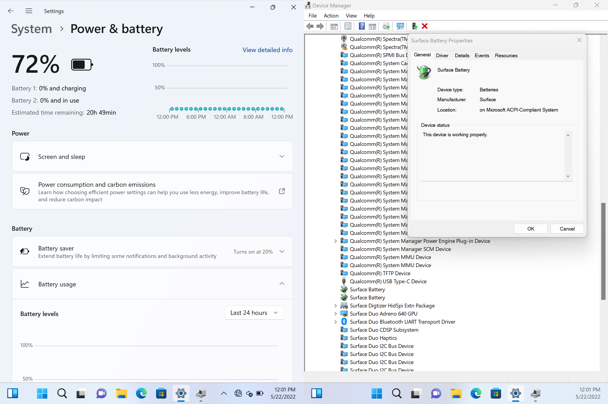

# Surface Duo (1st Generation) Battery Fuel Gauge Driver



This driver is designed for the Texas Instrument bq27742-G1 Fuel Gauges found in the Surface Duo (1st Generation) flashed with Microsoft own Firmware. It may work on other devices using the same fuel gauge provided you remove the manufacturer block reading code.

This driver enables Windows to get information about both battery packs used in Surface Duo. It does not provide charging capabilities.

## ACPI Sample

```asl
Device(BAT1)
{
    Name (_HID, "BQ27742")
    Name (_UID, 1)

    Name (_DEP, Package(0x1) {
        \_SB_.IC18
    })

    Method (_CRS, 0x0, NotSerialized) {
        Name (RBUF, ResourceTemplate () {
            I2CSerialBus(0x55,, 100000, AddressingMode7Bit, "\\_SB.IC18",,,,)
        })
        Return (RBUF)
    }
}
```